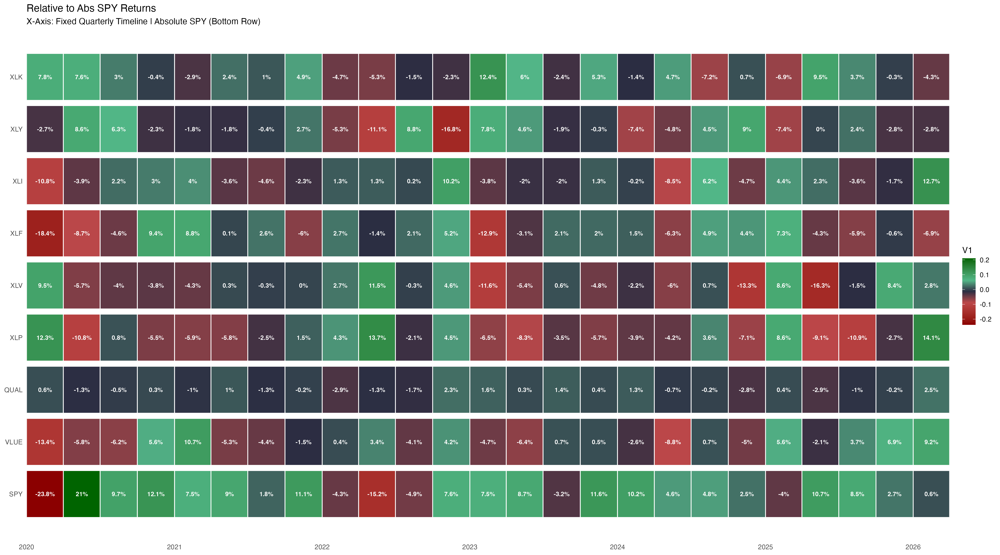

```{css, echo=FALSE}
body { font-family: "Inter", "Helvetica Neue", Arial, sans-serif; background: #f4f6fb; }
h1, h2, h3 { color: #1B2A4A; font-weight: 800; }
h2 { border-bottom: 2px solid #1B2A4A; padding-bottom: 6px; margin-top: 2em; }
.tag {
  display: inline-block; font-size: 10px; font-weight: 800;
  letter-spacing: .08em; text-transform: uppercase;
  padding: 2px 9px; border-radius: 10px; margin-right: 4px;
}
.tag-regime   { background: #D90429; color: #fff; }
.tag-saa      { background: #1B2A4A; color: #fff; }
.tag-pair     { background: #1E6E7A; color: #fff; }
.tag-screen   { background: #2D6A4F; color: #fff; }
.tag-dash     { background: #8B6510; color: #fff; }
.tag-param    { background: #6C3483; color: #fff; }
.finding-box {
  background: #f0f7ff; border-left: 4px solid #1B2A4A;
  padding: 10px 16px; margin: 12px 0; border-radius: 0 4px 4px 0;
  font-size: 13px;
}
.run-box {
  background: #1e1e2e; color: #cdd6f4; font-family: monospace;
  font-size: 12px; padding: 10px 16px; border-radius: 6px; margin: 8px 0;
}
.placeholder {
  background: #f0f0f0; border: 2px dashed #aab; color: #778;
  text-align: center; padding: 18px; border-radius: 6px;
  font-size: 12px; font-style: italic; margin: 12px 0;
}
.section-img { margin: 12px 0; border: 1px solid #dde; border-radius: 6px;
               box-shadow: 0 2px 8px rgba(0,0,0,0.08); width: 100%; }
```

```{r setup, include=FALSE}
knitr::opts_chunk$set(echo = FALSE, message = FALSE, warning = FALSE)
library(tidyverse)
library(knitr)
library(kableExtra)
```

---

## At a Glance

```{r master-table}
dir_tbl <- tribble(
  ~`#`, ~Analysis,                          ~Type,         ~`Key Question`,                                              ~Format,        ~Parameterised,
  "1",  "Executive Summary",                "Master",      "What does the full 8-section analysis conclude?",            "HTML",         "No",
  "2",  "SPY Tactical Replacement Study",   "Screen",      "Which ETFs can replace or amplify SPY tactically?",          "HTML / PDF",   "No",
  "3",  "SPY Regime & State Machine",       "Regime",      "How does the 3-state SPY drawdown engine work?",             "HTML / PDF",   "No",
  "4",  "L/S Pair Factsheet",               "Pair",        "How does ticker X perform vs SPY across regimes?",           "HTML / PDF",   "Yes — ticker",
  "5",  "Exante Hypothesis",                "Screen",      "Is a ticker an Enhancer or Stabiliser vs benchmark?",        "HTML",         "Yes — bmk",
  "6",  "Long/Short Overlay Report",        "SAA/TAA",     "Does the L/S overlay add value over the SAA portfolio?",     "PDF",          "No",
  "7",  "Safe Haven Regime Signal",         "Regime",      "Can safe haven ETFs predict SPY regime transitions?",        "HTML",         "No",
  "8",  "SAA Execution Report",             "SAA",         "What is the current 3-book SAA portfolio state?",            "HTML",         "No",
  "9",  "Universe Pair Analysis v2",        "Screen",      "How does every ticker in the universe pair with SPY?",       "HTML",         "No",
  "10", "Pair Analysis & Portfolio Const.", "Pair / SAA",  "Which pairs qualify for portfolio inclusion?",               "HTML",         "No",
  "11", "Sovereign Intelligence",           "Dashboard",   "Live universe snapshot — allocation & performance",          "Flexdashboard","No",
  "12", "Sentinel Intelligence",            "Dashboard",   "Live signal & regime flags across the universe",             "Flexdashboard","No",
  "13", "Calendar Year Analog",             "Regime",      "Which prior years match the current path? Trend or reversal?","HTML",         "No",
  "14", "ETF Meta Dashboard",               "Dashboard",   "Universe-level performance & positioning snapshot",          "HTML",         "No",
  "15", "ETF Performance Report",           "Dashboard",   "YTD/MTD range chart + searchable performance table",         "HTML",         "No",
  "16", "KF1 — Anti-Diversification",       "Key Finding", "Why does low ρ produce WORSE MaxDD than theory predicts?",   "R Script",     "No",
  "17", "KF2 — L/S Pair Selection",         "Key Finding", "Why must a SPY replacement have ρ > 0.75?",                  "R Script",     "No"
)

kable(dir_tbl, align = c("c","l","c","l","c","c")) %>%
  kable_styling(full_width = TRUE,
                bootstrap_options = c("hover", "condensed", "bordered"),
                font_size = 13) %>%
  row_spec(0,  bold = TRUE, background = "#1B2A4A", color = "white") %>%
  row_spec(1,  background = "#F2F5FD") %>%   # master
  row_spec(2,  background = "#F2FAF2") %>%   # screen
  row_spec(3,  background = "#FDF2F2") %>%   # regime
  row_spec(4,  background = "#F2F5FD") %>%   # pair
  row_spec(5,  background = "#F2FAF2") %>%   # screen
  row_spec(6,  background = "#FDF5F0") %>%   # saa/taa
  row_spec(7,  background = "#FDF2F2") %>%   # regime
  row_spec(8,  background = "#FDF5F0") %>%   # saa
  row_spec(9,  background = "#F2FAF2") %>%   # screen
  row_spec(10, background = "#F2F5FD") %>%   # pair/saa
  row_spec(11, background = "#FDFAF0") %>%   # dash
  row_spec(12, background = "#FDFAF0") %>%   # dash
  row_spec(13, background = "#FDF2F2") %>%   # regime
  row_spec(14, background = "#FDFAF0") %>%   # dash
  row_spec(15, background = "#FDFAF0") %>%   # dash
  row_spec(16, background = "#F5F0FF") %>%   # key finding
  row_spec(17, background = "#F5F0FF") %>%   # key finding
  column_spec(1, bold = TRUE, color = "#1B2A4A", width = "2em") %>%
  column_spec(3, bold = TRUE)
```

---

## 1. Executive Summary

<span class="tag tag-master" style="background:#1B2A4A;color:#fff;">Master</span>

**File:** `Rmd/executive_summary.Rmd`

The canonical top-level document. Synthesises findings from all eight analytical workstreams
into a single institutional-quality report. Covers the regime engine, relative performance
taxonomy (HEDGE / STABLE / ALPHA / LAG / LOSS), safe haven analysis, anti-diversification
finding, SAA portfolio rationale, and TAA top calls.

<div class="finding-box">
**Core finding embedded here:** Anti-diversification — for a long-only blended portfolio,
MaxDD is minimised by minimising the ticker's own standalone drawdown, NOT by minimising
correlation. A ρ=0.8 ticker with 15% DD beats a ρ=0.1 ticker with 40% DD.
</div>

<div class="run-box">rmarkdown::render(here::here("Rmd/executive_summary.Rmd"))</div>

```{r img-exec, echo=FALSE, out.extra='class="section-img"'}
knitr::include_graphics("../key_plots/executive_summary.png")
```

---

## 2. SPY Tactical Replacement Study

<span class="tag tag-screen">Screen</span>

**File:** `Rmd/SPY_tactical_replacement_study.Rmd`
**Output also in:** `key_plots/SPY_tactical_replacement_study.html`

Screens the full equity universe for tickers that can replace or tactically amplify SPY.
Identifies **Cycle Amplifiers** (LOSS / ALPHA / ALPHA across Fall / Recovery / Consolidation),
sector archetypes, and factor ETFs. Confirms SMH, XLK, QQQ are the only three qualifying
Cycle Amplifiers in the universe.

<div class="finding-box">
**KF3 candidate:** LOSS/ALPHA/ALPHA pattern is exclusive to US tech/growth β > 1 names.
Only SMH (IR=0.90), XLK (IR=0.51), QQQ (IR=0.48) pass ρ > 0.75 and MaxDD screens.
</div>

<div class="run-box">rmarkdown::render(here::here("Rmd/SPY_tactical_replacement_study.Rmd"))</div>

```{r img-tactical, echo=FALSE, out.extra='class="section-img"'}
knitr::include_graphics("../key_plots/spy_tactical_screen.png")
```

---

## 3. SPY Regime & State Machine

<span class="tag tag-regime">Regime</span>

**File:** `Rmd/spy_regime_statemachine_report.Rmd`

Documents the SPY drawdown cycle engine — a 3-state classification (Fall / Recovery /
Consolidation) using a hysteresis state machine driven entirely by `xts_ret[,"SPY"]`.
Covers transition diagrams, 200DMA signal overlays, regime-conditional alpha heatmaps,
and multi-ticker overlays.

| Constant | Value |
|---|---|
| T_FALL threshold | 10% drawdown |
| 200DMA hysteresis | upper +4% / lower −2% |

<div class="run-box">rmarkdown::render(here::here("Rmd/spy_regime_statemachine_report.Rmd"))</div>

```{r img-regime, echo=FALSE, out.extra='class="section-img"'}
knitr::include_graphics("../key_plots/spy_rel_quarterly.png")
```

---

## 4. L/S Pair Factsheet

<span class="tag tag-pair">Pair</span>
<span class="tag tag-param">Parameterised</span>

**File:** `Rmd/pair_factsheet.Rmd`
**Runner:** `render_pair_factsheet()` in `scripts_saa_taa/taa_regime_engine.R`
**Output also in:** `key_plots/factsheet_XLK_SPY.html`

Institutional-quality factsheet for any ticker vs a benchmark. Seven-panel visual engine
plus a standalone three-view return distribution (violin + zoomed box + ridgeline density).
Tables cover per-regime alpha, confidence scoring, rolling ρ, and rolling IR decomposed
by regime.

**Sections:**

| Section | Content |
|---|---|
| 1 | Pair summary + archetype classification |
| 2 | Regime confidence table (α, t-stat, consistency, score) |
| 3 | Stats + three-view distribution troika + rolling IR by regime |
| 4 | 7-panel factsheet (wealth · spread · DD · dist · ρ · regime ρ · IR) + troika |
| 5 | Regime overlay & alpha summary |
| 6 | Per-episode heatmap |

<div class="run-box">
source(here::here("scripts_saa_taa/taa_regime_engine.R"))
render_pair_factsheet("XLK")                        # HTML
render_pair_factsheet("GLD", format = c("html","pdf"))
# Batch:
for (tk in c("SMH","XLK","QQQ")) render_pair_factsheet(tk, open = FALSE)
</div>

```{r img-factsheet, echo=FALSE, out.extra='class="section-img"'}
knitr::include_graphics("../key_plots/factsheet_XLK_SPY.png")
```

---

## 5. Exante Hypothesis

<span class="tag tag-screen">Screen</span>
<span class="tag tag-param">Parameterised</span>

**File:** `Rmd/exante_hypothesis_report.Rmd`
**Runner:** `render_exante_report()` in `scripts_exante_hypothesis/`

Classifies every ticker in the universe as **Enhancer** (improves return vs benchmark blend)
or **Stabiliser** (improves risk/DD vs benchmark blend) using a quadrant plot of
annualised return vs MaxDD improvement. Parameterised by benchmark (`bmk`) and blend weight.

<div class="finding-box">
**Confirms anti-diversification:** tickers with ρ ≈ 0 do NOT reduce portfolio DD.
The Enhancer/Stabiliser boundary is driven by standalone DD, not correlation.
</div>

<div class="run-box">
source(here::here("scripts_exante_hypothesis/exante_engine.R"))
render_exante_report("SPY")    # screen vs SPY
render_exante_report("AGG")    # screen vs AGG
</div>

```{r img-exante, echo=FALSE, out.extra='class="section-img"'}
knitr::include_graphics("../key_plots/exante_quadrant.png")
```

---

## 6. Long/Short Overlay Report

<span class="tag tag-saa">SAA/TAA</span>

**File:** `Rmd/long_short_overlay_report.Rmd`

Two-phase back-test of the regime-driven L/S overlay on top of the SAA portfolio.
Phase 1: signal construction and regime alignment. Phase 2: portfolio integration,
performance attribution, and MaxDD reduction vs long-only.

<div class="run-box">rmarkdown::render(here::here("Rmd/long_short_overlay_report.Rmd"))</div>

```{r img-ls, echo=FALSE, out.extra='class="section-img"'}
knitr::include_graphics("../key_plots/ls_overlay_wealth.png")
```

---

## 7. Safe Haven Regime Signal

<span class="tag tag-regime">Regime</span>

**File:** `Rmd/safe_haven_regime_report.Rmd`

Three-method exploration of whether safe haven ETFs (GLD, IEF, TLT) can predict SPY
regime transitions before they occur.

| Method | Approach | Status |
|---|---|---|
| 1 | Rolling correlation breakdown | Active |
| 2 | LASSO logistic regression | AUC ≈ 0.72 at 63-day horizon |
| 3 | PCA eigenanalysis on Fall−Consolidation covariance | Active |

<div class="finding-box">
**Key nuance:** GLD and IEF record negative alpha in Recovery (SPY rebounds faster)
but their absolute returns often stay positive — this is opportunity cost, not a loss.
</div>

<div class="run-box">rmarkdown::render(here::here("Rmd/safe_haven_regime_report.Rmd"))</div>

```{r img-safehaven, echo=FALSE, out.extra='class="section-img"'}
knitr::include_graphics("../key_plots/calendar_heatmap_GLD.png")
```

---

## 8. SAA Execution Report

<span class="tag tag-saa">SAA</span>

**File:** `Rmd/saa_execution_report.Rmd`

Operational execution report for the Sovereign SAA 3-book portfolio. Covers current
weights, drift from policy, spring-load signals, YTD performance attribution, and
the Sovereign 5 roster.

**SAA Portfolio (policy weights):**

| Ticker | Weight | Role |
|---|---|---|
| AGG | 35% | Core-Stabiliser |
| URTH | 25% | Anchor |
| SPY | 25% | Anchor |
| QQQ | 5% | Core-Growth |
| XLK | 5% | Core-Growth |
| SMH | 5% | Satellite |

<div class="run-box">rmarkdown::render(here::here("Rmd/saa_execution_report.Rmd"))</div>

```{r img-saa, echo=FALSE, out.extra='class="section-img"'}
knitr::include_graphics("../03_reports/saa_portfolio_snapshot.png")
```

---

## 9. Universe Pair Analysis v2

<span class="tag tag-screen">Screen</span>

**File:** `Rmd/universe_pair_analysis_v2.Rmd`

Runs the pair analysis engine across the full 96-ticker Sovereign Universe vs SPY.
Produces correlation matrix, IR ranking, MaxDD comparison, and archetype distribution
for every ticker. Used for universe-level screening before drilling into individual
pair factsheets.

<div class="run-box">rmarkdown::render(here::here("Rmd/universe_pair_analysis_v2.Rmd"))</div>

```{r img-universe, echo=FALSE, out.extra='class="section-img"'}

```

---

## 10. Pair Analysis & Portfolio Construction

<span class="tag tag-pair">Pair</span>
<span class="tag tag-saa">SAA</span>

**File:** `Rmd/pair_analysis_portfolio_construction.Rmd`

Bridges individual pair analysis and SAA portfolio construction. Applies KF2 screening
criteria (ρ > 0.75, MaxDD < −30%) to identify eligible L/S pairs, then builds candidate
portfolio overlays and stress-tests them against the regime table.

<div class="finding-box">
**KF2:** L/S pair to replace SPY requires ρ > 0.75. Only SMH (IR=0.90), XLK (IR=0.51),
QQQ (IR=0.48) qualify — all US equity tech/growth. No fixed income or commodity passes.
</div>

<div class="run-box">rmarkdown::render(here::here("Rmd/pair_analysis_portfolio_construction.Rmd"))</div>

```{r img-kf2, echo=FALSE, out.extra='class="section-img"'}
knitr::include_graphics("../key_plots/pair_portfolio_kf2.png")
```

---

## 11 & 12. Intelligence Dashboards

<span class="tag tag-dash">Dashboard</span>

**Files:**
- `Rmd/sovereign_intelligence.Rmd` — full universe allocation overview
- `Rmd/sentinel_intelligence.Rmd` — signal & regime flag layer

Live flexdashboards covering the full Sovereign Universe. Sovereign shows allocation,
asset class breakdown, and portfolio context. Sentinel shows momentum status, 200DMA
flags, regime alerts, and outlier signals. Intended for daily/weekly monitoring.

<div class="run-box">
rmarkdown::render(here::here("Rmd/sovereign_intelligence.Rmd"))
rmarkdown::render(here::here("Rmd/sentinel_intelligence.Rmd"))
</div>

<div class="placeholder">Screenshots pending — render dashboards, save representative panels to key_plots/sovereign_dash.png and key_plots/sentinel_dash.png</div>

---

---

## 13. Calendar Year Analog Projection

<span class="tag tag-regime">Regime</span>

**File:** `Rmd/calendar_analog_report.Rmd`

Projects the current year's return path against historical calendar-year analogs.
Estimates trend-continuation vs mean-reversion probability from the closest matching
prior years. Useful for framing tactical positioning within the current calendar year.

<div class="run-box">rmarkdown::render(here::here("Rmd/calendar_analog_report.Rmd"))</div>

<div class="placeholder">Screenshot pending — render report, save analog chart to key_plots/calendar_analog.png</div>

---

## 14. ETF Meta Dashboard

<span class="tag tag-dash">Dashboard</span>

**File:** `Rmd/etf_meta_dashboard.Rmd`

Universe-level performance and positioning snapshot. Covers YTD/MTD returns,
52-week range positions, momentum status, and asset class breakdown across
the full Sovereign Universe. Designed for weekly monitoring.

<div class="run-box">rmarkdown::render(here::here("Rmd/etf_meta_dashboard.Rmd"))</div>

<div class="placeholder">Screenshot pending — render report, save universe view to key_plots/etf_meta_dashboard.png</div>

---

## 15. ETF Performance Report

<span class="tag tag-dash">Dashboard</span>

**File:** `Rmd/etf_performance_report.Rmd`

Static HTML snapshot of YTD/MTD returns and 52-week range positions across the
sovereign universe. Includes a `ggplot` range chart faceted by asset class
(colour = trend regime, label = YTD) and a searchable `reactable` performance table.

<div class="run-box">rmarkdown::render(here::here("Rmd/etf_performance_report.Rmd"))</div>

<div class="placeholder">Screenshot pending — render report, save range chart to key_plots/etf_performance.png</div>

---

## 16 & 17. Key Findings (Standalone Scripts)

<span class="tag tag-screen">Screen</span>

**Files:**
- `key_findings/kf1_anti_diversification.R`
- `key_findings/kf2_ls_pair_selection.R`

Self-contained scripts that each load their own data, produce labelled plots,
and print a summary table. Canonical empirical discoveries — not Rmd reports
but the definitive source of record for these findings.

| # | Finding | Result |
|---|---|---|
| KF1 | Low-ρ tickers have **worse** empirical MaxDD than Magdon-Ismail predicts | Confirmed across full 96-ticker universe; high-ρ tickers track theory |
| KF2 | L/S pair to replace SPY requires ρ > 0.75 | Only SMH (IR=0.90), XLK (IR=0.51), QQQ (IR=0.48) pass — all Equity |

**KF2 screening parameters:** `RHO_SCREEN = 0.75`, `MDD_SCREEN = -0.30`

<div class="run-box">
source(here::here("key_findings/kf1_anti_diversification.R"))
source(here::here("key_findings/kf2_ls_pair_selection.R"))
</div>

```{r img-kf2b, echo=FALSE, out.extra='class="section-img"'}
knitr::include_graphics("../key_plots/pair_portfolio_kf2.png")
```

---

## Render All

```r
# Parameterised reports — run once per ticker of interest
source(here::here("scripts_saa_taa/taa_regime_engine.R"))
for (tk in c("SMH", "XLK", "QQQ", "GLD", "AGG")) {
  render_pair_factsheet(tk, open = FALSE)
}

# Static reports
static <- c(
  "Rmd/executive_summary.Rmd",
  "Rmd/SPY_tactical_replacement_study.Rmd",
  "Rmd/spy_regime_statemachine_report.Rmd",
  "Rmd/safe_haven_regime_report.Rmd",
  "Rmd/long_short_overlay_report.Rmd",
  "Rmd/saa_execution_report.Rmd",
  "Rmd/universe_pair_analysis_v2.Rmd",
  "Rmd/pair_analysis_portfolio_construction.Rmd",
  "Rmd/sovereign_intelligence.Rmd",
  "Rmd/sentinel_intelligence.Rmd"
)

purrr::walk(static, ~ rmarkdown::render(here::here(.x)))
```

---

*Generated `r Sys.Date()` · ETF Intelligence Project · Sovereign Universe 96 tickers*
